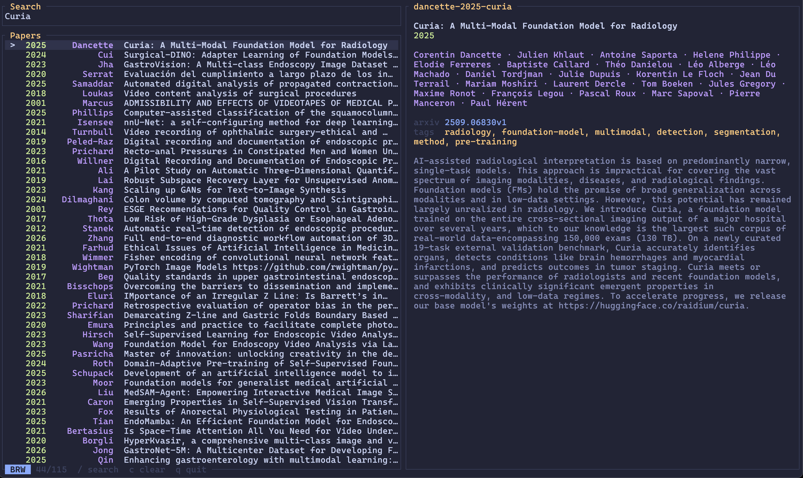

# Grimoire

A fast TUI reference manager.



## Install

Requires Rust.

```
cargo install --path .
```

Or with just:

```
just install
```

## Usage

```
grimoire                          # browse library
grimoire jepa                     # browse with "jepa" pre-filled
grimoire add 1706.03762           # import by arXiv ID (fetches metadata + PDF)
grimoire add 10.1038/nature14539  # import by DOI (fetches metadata)
grimoire add paper.pdf            # import local PDF
grimoire cite --format typst      # pick a reference, output @cite-key
grimoire reindex                  # rebuild search index from filesystem
grimoire validate                 # check library integrity
grimoire validate --fix           # auto-fix issues (rename temp files, remove junk)
```

### TUI keybindings

| Key | Action |
|-----|--------|
| `j / k` | Move down / up |
| `g / G` | Jump to top / bottom |
| `/ or i` | Enter search mode |
| `enter` | Open PDF (browse), confirm search (search) |
| `e` | Edit info.toml |
| `y` | Copy BibTeX |
| `o` | Open DOI / arXiv in browser |
| `p` | Open PDF in Polaris |
| `a` | Add paper (path, DOI, arXiv, URL) |
| `r` | Enrich selected (fetch metadata) |
| `R` | Enrich all with missing fields |
| `s` | Cycle sort (name/author/year/title) |
| `d` | Deduplicate library |
| `I` | Reindex library |
| `V` | Validate library (auto-fix) |
| `t` | Browse tags |
| `T` | Switch theme |
| `?` | Help |
| `q` | Quit |

## Library layout

```
~/Papers/
  vaswani-2017-attention/
    info.toml
    vaswani-2017-attention.pdf
  lecun-2015-deep/
    info.toml
```

Directory naming: `{first-author}-{year}-{first-title-word}`.

### info.toml

```toml
title = "Attention Is All You Need"
authors = ["Ashish Vaswani", "Noam Shazeer", "Niki Parmar"]
year = 2017
arxiv = "1706.03762"
tags = ["transformers", "nlp"]
files = ["vaswani-2017-attention.pdf"]
abstract = """
The dominant sequence transduction models are based on complex recurrent or
convolutional neural networks...
"""
```

## Configuration

Optional. Grimoire works without any config file.

`~/.config/grimoire/config.toml`:

```toml
library = "~/Papers"       # default
editor = "hx"              # defaults to $EDITOR
reader = "open"            # defaults to $GRIM_READER or "open"
theme = "tokyo-night-moon" # default
```

Environment variables: `$GRIM_LIBRARY`, `$GRIM_READER`, `$EDITOR`.

## Helix integration

Add to `~/.config/helix/config.toml`:

```toml
[keys.normal.space.r]
r = [":insert-output grimoire cite", ":redraw"]
t = [":insert-output grimoire cite --format typst", ":redraw"]
l = [":insert-output grimoire cite --format latex", ":redraw"]
```

`Space r t` in normal mode opens Grimoire and inserts a Typst citation at the cursor.

## Smart import

`grimoire add` detects the input type automatically:

- **arXiv ID** (`1706.03762`) — fetches metadata from arXiv API, downloads PDF
- **arXiv URL** (`https://arxiv.org/abs/1706.03762`) — same
- **DOI** (`10.1038/nature14539`) — fetches metadata from CrossRef
- **Local PDF** (`paper.pdf`) — extracts metadata from PDF; if filename looks like an arXiv ID, fetches metadata from arXiv
